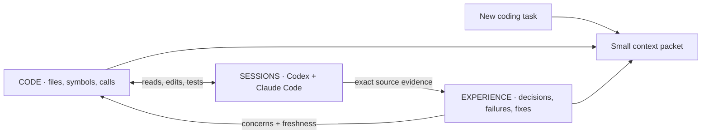

# Motif Solo

**An experience graph for coding agents.**

[](https://github.com/motif-Labs/motif-solo/actions/workflows/ci.yml)
[](LICENSE)
[](package.json)

Coding agents should not rediscover your repository every session.

Motif Solo connects your codebase with what **Codex and Claude Code have already tried, learned, and changed**. A new session can retrieve relevant symbols, previous failures, decisions, fixes, and the evidence behind them before exploring the repository again.

Local storage. No account. No API key. No model calls or telemetry during indexing and retrieval.



## What an agent gets

Ask about a refresh-token race, and the graph can connect the relevant code to a previous attempt:

```text
Code:        src/token.ts → refreshToken() → serializeSession()
Prior work:  Claude reported that optimistic locking failed on a TTL race.
Later work:  Codex reported a fix using per-session serialization.
Evidence:    Exact session, message, and transcript line for each claim.
Freshness:   Code changes are flagged; historical claims remain unverified.
```

This example is synthetic and reproducible with `npm run demo`. It illustrates the data model, not a measured speedup.

## Try it

**Requires Node.js 22 or newer, npm, and Git.** macOS and Linux are tested in CI. SQLite uses a native dependency; platforms without a prebuilt binary need a C/C++ toolchain and Python.

The npm package is prepared under the name `motif-solo`; the initial registry release is pending. Install from source today:

```bash
git clone https://github.com/motif-Labs/motif-solo.git
cd motif-solo
npm ci
npm run build
npm link

cd /path/to/your/repository
motif-solo init --integrate
motif-solo context "fix the refresh token race"
```

`init` scans code, discovers matching local Codex and Claude Code transcripts, and builds `.rex/graph.db`. With `--integrate`, it also registers a repository-scoped MCP server in both agents' project configurations. Existing settings are preserved and backed up locally. Restart the clients and complete their normal project trust/MCP approval flow.

The short command `rex` is an alias for `motif-solo`.

### See the core loop without personal history

```bash
# In this project's checkout:
npm run demo
```

The demo creates a temporary repository with synthetic code and two synthetic sessions, imports them, queries the connected graph, and removes the temporary data. It never reads your agent history.

## Use it from either agent

The same local MCP server serves Codex and Claude Code:

- **`rex_context`** — a bounded code/experience packet for the current task.
- **`rex_neighbors`** — follow calls, imports, tests, sessions, and findings.
- **`rex_evidence`** — inspect a cited message and redacted source lines.
- **`rex_sessions`** — browse imported sessions and message pages.
- **`rex_record`** — record a finding with exact supporting quotes and code targets.

The server asks agents to retrieve context before exploring unfamiliar code. Tool availability does not guarantee that a model will use it. For a first check, ask your agent to call `rex_context` for a symbol you have worked on before.

```bash
motif-solo sync                         # refresh code and changed transcripts
motif-solo watch                        # refresh continuously
motif-solo status                       # graph and import counts
motif-solo sessions                     # inspect imported history
motif-solo inspect file:src/token.ts    # inspect connected nodes
motif-solo inspect file:src/token.ts --dot > graph.dot
motif-solo integrate --print            # inspect MCP launch configuration
```

Imports use `$CODEX_HOME` / `~/.codex` and `$CLAUDE_CONFIG_DIR` / `~/.claude`. Override them with `--codex-dir` and `--claude-dir`; pointing both at empty directories indexes code alone. Session metadata and Git worktree identity determine repository scope. Use `--alias` only when intentionally mapping a former checkout. See [agent formats and integration](docs/agent-formats.md).

## What is implemented

**Code structure.** TypeScript/JavaScript files, symbols, resolved imports and calls, package dependencies, and test import relationships. Other supported source languages have file-level indexing. Relationships are static evidence, not complete dynamic call graphs or proof of test coverage.

**Session history.** Codex rollouts, Claude parent-linked conversations, tool calls/results, Claude subagents, and recognizable handoff lineage. Normalized records connect to code. Compressed original snapshots preserve provenance even after a transcript is rewritten.

**Experience.** Conservative extraction of explicit retrospective decisions, failures, fixes, gotchas, and command outcomes. Findings link to their source messages and exact code anchors. Agents can add structured findings with validated quotations; contradiction and resolution edges remain inspectable. A failed command alone does not establish why an approach failed.

**Selective retrieval.** SQLite FTS5 plus graph expansion, code-identifier boosts, duplicate caps, and a small context budget. No embedding provider is required. Changed or deleted code is flagged at query time. Missing historical proof stays **unverified**, and reported solutions are not automatically declared correct.

## Privacy and trust

Your local `.rex/` directory contains source-derived data and **original, unredacted session snapshots**. Motif Solo adds it to Git's local exclude file and uses restrictive filesystem permissions. Query responses redact common secret patterns and sensitive structured fields, but redaction is not anonymization or a guarantee that every secret is removed.

Do not commit or share `.rex/`, generated agent configurations, or benchmark traces. A session can contain activity outside its initial repository. Review source selection before importing sensitive history. Once an agent retrieves a packet, its own provider and data settings govern that context.

Historical text is untrusted evidence. Motif Solo does not execute commands from imported transcripts. The explicit benchmark runner does execute the commands in your benchmark specification. Read the [security policy and trust boundaries](SECURITY.md) before using an unfamiliar repository or benchmark spec.

## Status and measurement

**Early working release, with known limits.** The end-to-end loop has been checked against a real repository and historical sessions from both agents. Public tests and the demo use synthetic data only.

Automatic extraction is English-oriented and intentionally limited. Indexing rescans code; dynamic dispatch, automatic rename tracking, semantic embeddings, and a graph UI are not implemented. Context budgets estimate tokens as characters divided by four. Session formats may change between agent releases.

**No agent speedup claim has been established.** The [A/B benchmark harness](docs/benchmark.md) runs the same task/model/commit in separate worktrees, captures native traces, and invokes an external success check. It can measure tool calls, repeated exploration, turns, available token usage, and wall-clock time. Its current automated test uses a synthetic process, not a live-model benchmark.

## Develop and contribute

```bash
npm ci
npm run check           # types, behavioral tests, build
npm run format:check
npm run privacy:check   # source distribution privacy guard
npm run package:check   # actual tarball + fresh production install + CLI smoke
npm audit
```

Start with [CONTRIBUTING.md](CONTRIBUTING.md), the [architecture](docs/architecture.md), and the [release guide](docs/releasing.md). Parser fixtures, evidence quality, linking precision, and reproducible evaluations are especially useful contributions. Use synthetic sessions in issues and pull requests.

## Built from Motif

Motif Solo reuses the Apache-2.0 session readers, schema, fixtures, and selected search/redaction helpers from [Motif](https://github.com/motif-Labs/motif). It focuses that infrastructure on a local code/session/experience graph. The [inspection and reuse notes](docs/motif-inspection.md) explain what was kept, changed, and left out; [NOTICE](NOTICE) preserves attribution.

**[Apache License 2.0](LICENSE).** Commercial use is permitted under the license. Third-party attribution and license obligations still apply.
